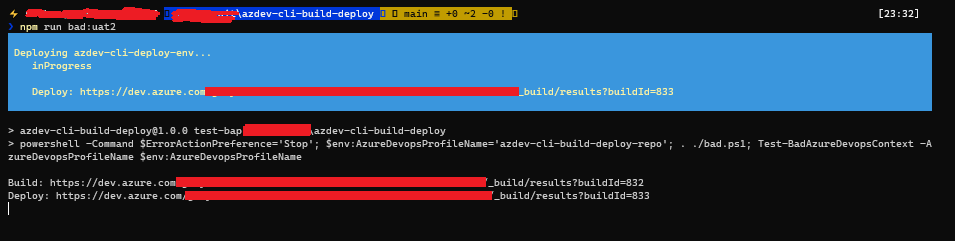
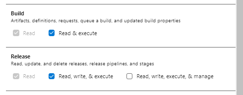

# azdev-cli-build-deploy
CLI Workflow/POC to build and deploy branches to test environments from the cli. 

```
npm run bad:uat2
```

...will queue and wait for a build pipeline to complete; then queue and wait for a deployment pipeline to consume the build resources and deploy to an environment:



Only tested with YAML pipelines. Doubt it will work with Classic Release pipelines.

## Usage
From Windows Terminal, and on the branch you are working, do something like this:

```bash
npm run bad
npm run bad:uat1
npm run bad:uat2
```

The npm commands just delegate the calls to PowerShell. 

### Why?
For the use case where we need adhoc deployments of our current branch to different environments. 

## Setup
This is intended to run on top of PowerShell (or Posh Core) and uses the VsTeam PowerShell Module. A Personal Access Token is required to access the REST API.  

To set up a Least Privelege PAT:



To set up the PowerShell session before running any commands:

```
Install-Module vsteam
Add-VsTeamProfile -Account YOURVSTSACCOUNT -PersonalAccessToken YOURPAT -Name azdev-cli-build-deploy-repo
```

The profile 'azdev-cli-build-deploy-repo' will be set by all of the npm commands (via Set-VsTeamAccount) to ensure the context is correct before running any PowerShell code. 

## Design decisions
The PowerShell logic is in the bad.ps1 file. 

I have wrapped up the calls with npm to show it all hanging together; my feeling is it makes sense to turn bad.ps1 into a DSL for your use case and forego npm completely. 

## Commands
A list of npm commands:

| Command                       | Description                                                                    |
| ----------------------------- | ------------------------------------------------------------------------------ |
| npm run test-bad              | Verifies everything is configured            |
| npm run bad                   | Build a YAML Pipeline; then Deploy using its resources |
| npm run bad:uat1              | Build a YAML Pipeline; then Deploy using its resources to uat1 |
| npm run bad:uat2              | Build a YAML Pipeline; then Deploy using its resources to uat2 |

The environments are really just a parameter in the deployment pipeline itself - see build/azure-devops/deploy-env.yml for more information. 

### Infrastructure
Three example pipelines are included - the npm commands directly refer to them to queue new builds and wait for completion:

| Build File     | Azure DevOps Build Definition | Description                                                                |
| -------------- | ----------------------------- | -------------------------------------------------------------------------- |
| build.yml      | azdev-cli-build               | A simple build; the scripts wait for completion before scheduling the next | 
| deploy.yml     | azdev-cli-deploy              | A simple deploy (no environment) |
| deploy-env.yml | azdev-cli-deploy-env          | A simple deploy (parameterized to deploy to the chosen environment using resources from azdev-cli-build |

### Environments
In Azure DevOps, there are two Environments set up that match the options in deploy-env.yml:

1. azdev-cli-uat1
2. azdev-cli-uat2
